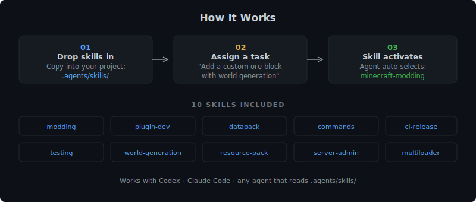

# minecraft-agent-skills

[](https://github.com/Jahrome907/minecraft-agent-skills/actions/workflows/skills-audit.yml)
[](LICENSE)
[](https://github.com/Jahrome907/minecraft-agent-skills/releases/latest)
[](https://www.minecraft.net/)

A public skills bundle of **12 AI coding agent skills** covering every major area
of Minecraft development — mods, plugins, datapacks, commands, testing, CI/CD,
world generation, resource packs, server administration, WorldEdit operations,
and EssentialsX operations.

Use it either as raw skill folders for Codex or Claude Code, or as a dual-target
plugin bundle under `plugins/minecraft-codex-skills/` for plugin-based installs.

The repository is branded as `minecraft-agent-skills`; the bundled plugin/package
identifier remains `minecraft-codex-skills` for marketplace and install compatibility.

<!-- markdownlint-disable MD033 -->
<p align="center">
      
</p>
<!-- markdownlint-enable MD033 -->

Use the raw-skill path if you want to copy `.agents/`, `.codex/`, or `.claude/`
directly into a project. Use the plugin path if you want to keep the repository
layout intact and load `plugins/minecraft-codex-skills/` through Codex's local
marketplace flow or Claude Code's `--plugin-dir` support.

---

## What is a Codex Skill?

Codex skills live in `.agents/skills/<skill-name>/` within a repository and are
read by [OpenAI Codex](https://openai.com/index/introducing-codex/) whenever you
assign it a task. Each `SKILL.md` file defines the skill's `name`, `description`,
and detailed instructions. Codex selects relevant skills automatically based on
the description field and your task.

This repository keeps `.agents/skills/` as the canonical source of truth and
syncs exact mirrors to `.codex/skills/`, `.claude/skills/`, and the shared plugin
bundle at `plugins/minecraft-codex-skills/skills/`.
The routing index lives at `.agents/skills/README.md`.

---

## Skills in this Collection

|Skill|Directory|What it covers|
|---|---|---|
|**minecraft-modding**|`minecraft-modding/`|NeoForge + Fabric mod development — blocks, items, entities, events, data gen|
|**minecraft-plugin-dev**|`minecraft-plugin-dev/`|Paper/Bukkit server plugins — events, commands, schedulers, PDC, Adventure, Vault|
|**minecraft-datapack**|`minecraft-datapack/`|Vanilla datapacks — functions, advancements, recipes, loot tables, tags|
|**minecraft-commands-scripting**|`minecraft-commands-scripting/`|Vanilla commands, scoreboards, NBT paths, JSON text, RCON scripting|
|**minecraft-multiloader**|`minecraft-multiloader/`|Architectury multiloader — single codebase targeting NeoForge and Fabric|
|**minecraft-testing**|`minecraft-testing/`|JUnit 5, MockBukkit, NeoForge/Fabric GameTests, GitHub Actions CI|
|**minecraft-ci-release**|`minecraft-ci-release/`|GitHub Actions pipelines, Modrinth/CurseForge publishing, semantic versioning|
|**minecraft-world-generation**|`minecraft-world-generation/`|Custom biomes, dimensions, structures (datapacks + mods)|
|**minecraft-resource-pack**|`minecraft-resource-pack/`|Textures, block/item models, sounds, animations, OptiFine CIT, shaders|
|**minecraft-server-admin**|`minecraft-server-admin/`|Server setup, JVM tuning, Docker, Velocity proxy, backups, security|
|**minecraft-worldedit-ops**|`minecraft-worldedit-ops/`|WorldEdit ops playbooks: selections, masks, schematics, brushes, safe rollback|
|**minecraft-essentials-ops**|`minecraft-essentials-ops/`|EssentialsX ops: kits/warps/homes, economy, permissions, moderation workflows|

---

## Installation

### Option A — Raw skills for Codex

```bash
REPO_URL="https://github.com/Jahrome907/minecraft-agent-skills"
git clone "$REPO_URL" /tmp/mc-skills
cp -r /tmp/mc-skills/.agents .
```

Codex can read the canonical `.agents/skills/` tree directly. The `.codex/skills/`
mirror is kept byte-for-byte identical if you prefer that layout.

### Option B — Raw skills for Claude Code

```bash
REPO_URL="https://github.com/Jahrome907/minecraft-agent-skills"
git clone "$REPO_URL" /tmp/mc-skills
cp -r /tmp/mc-skills/.claude .
```

### Option C — Dual-target plugin bundle

The repository now ships a plugin bundle that both Codex and Claude Code can load:

```text
plugins/minecraft-codex-skills/
├── .codex-plugin/plugin.json
├── .claude-plugin/plugin.json
└── skills/
```

For Codex local marketplace installs:

1. Keep the repository layout intact so `.agents/plugins/marketplace.json` and `plugins/minecraft-codex-skills/` stay under the same repo root.
2. Start Codex from that repo root.
3. Open the plugins surface with `/plugins`.
4. Install `minecraft-codex-skills` from the repo marketplace discovered at `.agents/plugins/marketplace.json`.
5. Restart Codex after plugin changes so the local cached copy refreshes.

For Claude Code local plugin testing:

```bash
claude --plugin-dir ./plugins/minecraft-codex-skills
```

### Option D — Git submodule

```bash
REPO_URL="https://github.com/Jahrome907/minecraft-agent-skills"
git submodule add "$REPO_URL" .skills-src
cp -r .skills-src/.agents .
```

### Option E — Manual download

Download the latest release from
`https://github.com/Jahrome907/minecraft-agent-skills/releases/latest`.

- Use `.agents/` or `.codex/` for Codex raw-skill installs.
- Use `.claude/` for Claude Code raw-skill installs.
- Use `plugins/minecraft-codex-skills/` for Claude Code plugin installs.
- For Codex plugin installs, keep the full release layout intact so `.agents/plugins/marketplace.json` and `plugins/minecraft-codex-skills/` remain together under the same repo root.

---

## Project Structure

```text
your-project/
└── .agents/
    └── skills/
        ├── README.md
        ├── minecraft-modding/
        │   ├── SKILL.md
        │   ├── references/
        │   │   ├── neoforge-api.md
        │   │   ├── fabric-api.md
        │   │   └── common-patterns.md
        │   └── scripts/
        │       └── check-build.sh
        ├── minecraft-plugin-dev/
        │   ├── SKILL.md
        │   └── scripts/
        │       └── validate-plugin-layout.sh
        ├── minecraft-datapack/
        │   ├── SKILL.md
        │   └── scripts/
        │       └── validate-datapack.sh
        ├── minecraft-commands-scripting/
        │   └── SKILL.md
        ├── minecraft-multiloader/
        │   └── SKILL.md
        ├── minecraft-testing/
        │   └── SKILL.md
        ├── minecraft-ci-release/
        │   ├── SKILL.md
        │   └── scripts/
        │       └── validate-workflow-snippets.sh
        ├── minecraft-world-generation/
        │   ├── SKILL.md
        │   └── scripts/
        │       └── validate-worldgen-json.sh
        ├── minecraft-resource-pack/
        │   ├── SKILL.md
        │   └── scripts/
        │       └── validate-resource-pack.sh
        ├── minecraft-server-admin/
        │   └── SKILL.md
        ├── minecraft-worldedit-ops/
        │   └── SKILL.md
        └── minecraft-essentials-ops/
            └── SKILL.md

# Compatibility mirrors (same content, synced by script):
your-project/
├── .codex/
│   └── skills/
│       └── ... (mirrors .agents/skills)
└── .claude/
    └── skills/
        └── ... (mirrors .agents/skills)

# Dual-target plugin bundle (same skills, plugin manifests for both platforms):
your-project/
└── plugins/
      └── minecraft-codex-skills/
            ├── .codex-plugin/
            │   └── plugin.json
            ├── .claude-plugin/
            │   └── plugin.json
            └── skills/
                  └── ... (mirrors .agents/skills)
```

---

## Working On This Repo

Repo development tooling requires **Node 20+**. The copied skill directories do not
need the repo-root Node install.

The shell-based fixture scripts require **bash**, **jq**, and **rsync**. On Windows,
run those repo checks from WSL or Git Bash with those tools available on `PATH`.

```bash
# One-time: install/check local dev tools
bash ./scripts/setup-dev-tools.sh

# Install pinned repo tooling
npm ci

# Edit canonical skills only
$EDITOR .agents/skills/<skill>/SKILL.md

# Sync compatibility mirrors and plugin bundle
bash ./scripts/sync-skills-layout.sh sync

# Validate plugin manifests and marketplace metadata
node ./scripts/validate-plugin-bundle.mjs

# Run repository skill audit
node ./scripts/audit-skills.mjs

# Validate markdown/JSON/YAML doc snippets
node ./scripts/validate-doc-snippets.mjs

# Run validator fixture tests
bash ./scripts/run-skill-validator-fixtures.sh

# Run repo policy fixtures
bash ./scripts/test-repo-policy-fixtures.sh

# Validate GitHub community files
node ./scripts/check-github-community-files.mjs

# Run markdown lint from the pinned local dependency
npm run lint:md
```

---

## Usage with Codex CLI

```bash
# Install Codex CLI
npm install -g @openai/codex

# Mod development
codex "Add a custom ore block called Starstone that spawns in the deepslate layer \
      and gives 2-5 StarstoneGems when mined with iron pickaxe or better. NeoForge."

# Server plugin
codex "Create a Paper plugin that gives players a speed boost for 10 seconds \
      when they eat a golden apple, with a 60-second cooldown tracked in PDC."

# Datapack
codex "Write a datapack function that detects when a player kills 10 zombies \
      and gives them a custom advancement with a diamond reward."

# Server admin
codex "Generate a docker-compose.yml for a Paper 1.21.11 server with Aikar's \
      JVM flags, persistent volumes, and auto-restart on crash."
```

Codex reads the appropriate `SKILL.md` and picks up platform patterns, correct
API versions, JSON schemas, and build commands automatically.

If you prefer plugin installs in Codex, start Codex from the repository root,
open `/plugins`, and install `minecraft-codex-skills` from the repo marketplace
defined in `.agents/plugins/marketplace.json`.

---

## Usage with Claude Code Plugins

Use the bundled plugin for local testing or team distribution:

```bash
claude --plugin-dir ./plugins/minecraft-codex-skills
```

The plugin exposes the same 12 skills under the `minecraft-codex-skills` plugin
namespace while keeping the shared `skills/` content synchronized with the raw
skill trees.

---

## Usage with Codex

1. Open [Codex](https://chatgpt.com/codex)
2. Connect your GitHub repository
3. Assign a task — Codex reads the skills from your repo automatically

---

## Supported Versions

|Platform|Version|Java|
|---|---|---|
|NeoForge|1.21.x examples centered on 21.11.x|21|
|Fabric|1.21.11 line (`fabric-api:0.116.10+1.21.1`)|21|
|Paper/Bukkit|1.21.x (`paper-api:1.21.11-R0.1-SNAPSHOT`)|21|
|Vanilla datapack|1.21–1.21.11 (formats 48–94.1; `min_format` / `max_format` from 1.21.9+)|—|
|Resource pack|1.21–1.21.11 (formats 34–75.0; `min_format` / `max_format` from 1.21.9+)|—|

---

## Repo Notes

This repository is a small, owner-managed skills bundle rather than a broader contributor project.

If you need to inspect or update repo structure:

1. Edit canonical skill content in `.agents/skills/`
2. Keep `.codex/skills/`, `.claude/skills/`, and `plugins/minecraft-codex-skills/skills/` synchronized
3. Run `npm run check` before publishing repo-level changes

See [AGENTS.md](AGENTS.md) and [docs/skill-authoring-standard.md](docs/skill-authoring-standard.md) for the repo-specific editing model.

---

## License

MIT — free to use, modify, and share. See [LICENSE](LICENSE).
